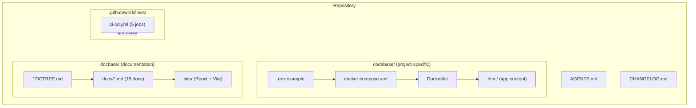
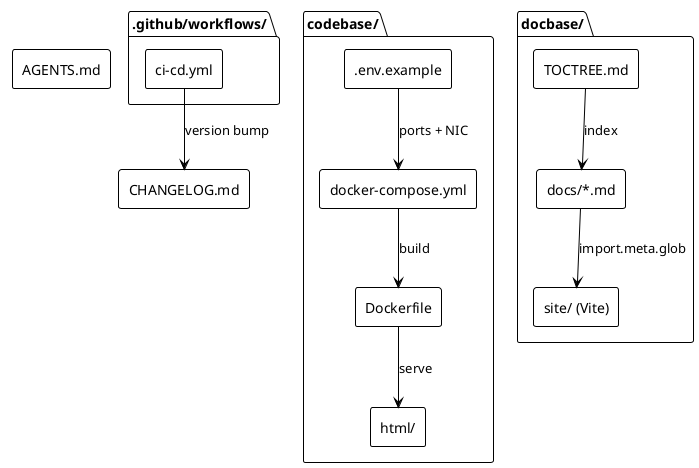
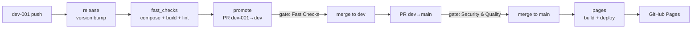
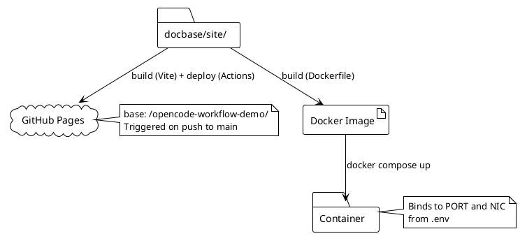

# Architecture

## Overview

This repository is a reusable template for OpenCode projects. It separates **implementation** (`codebase/`) from **documentation** (`docbase/`) and **CI/CD infrastructure** (`.github/`). The pipeline progressively promotes code through three branch gates before deploying a Vite-powered docs site to GitHub Pages.

## System structure (Mermaid)

## Components (PlantUML)

- **Service** — containerised application defined by `Dockerfile` + `docker-compose.yml`; ports and NIC come from `.env`.
- **Docs site** — React + Vite SPA that imports all `docs/*.md` at build time via `import.meta.glob` and renders them with `react-markdown`.
- **Pipeline** — five-job workflow (`release → fast_checks → promote → security_checks → pages`) that progressively promotes code from `dev-001` to GitHub Pages.

## CI/CD data flow (Mermaid)

## Deployment

The system deploys in two ways:

1. **Container** — `docker compose up --build` from `codebase/`; binds to the host port and NIC defined in `.env`.
2. **Docs site** — GitHub Actions builds the Vite app in `docbase/site/` and deploys the static artifact to GitHub Pages on every push to `main`.

### Deployment flow (PlantUML)

