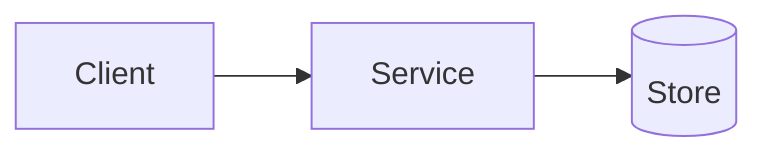

# Architecture

## Overview

_High-level description of the system._

## Components

- **Service** — _responsibility_
- **Store** — _responsibility_

## Data flow

1. _Step_

## Deployment

- _How the system is deployed (see `codebase/docker-compose.yml`)._
