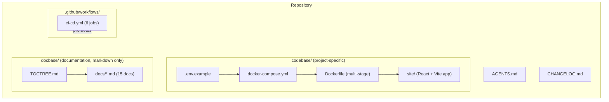
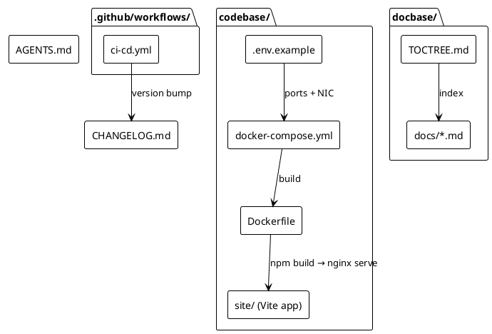
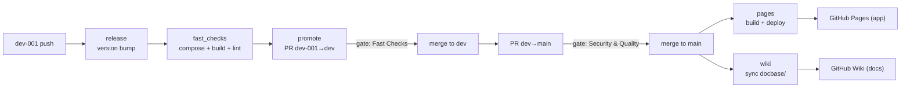
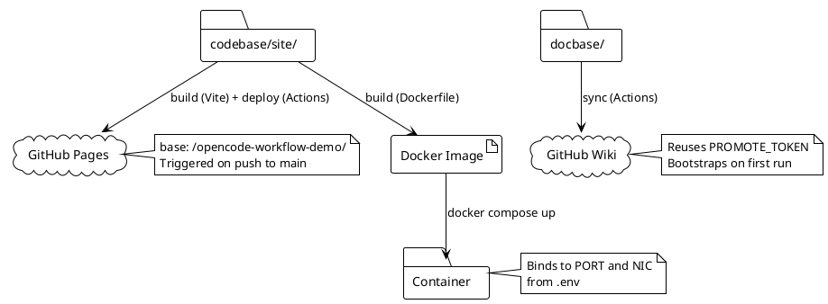

# Architecture

## Overview

This repository is a reusable template for OpenCode projects. It separates **implementation** (`codebase/`) from **documentation** (`docbase/`) and **CI/CD infrastructure** (`.github/`). The pipeline progressively promotes code through three branch gates before deploying a Vite application to GitHub Pages and documentation to the GitHub Wiki.

## System structure (Mermaid)

## Components (PlantUML)

- **Service** — containerised application defined by the multi-stage `Dockerfile` (a `node` stage builds the Vite app, an `nginx` stage serves `dist/`) + `docker-compose.yml`; ports and NIC come from `.env`.
- **App site** — React + Vite SPA in `codebase/site/`, deployed to GitHub Pages. The container and Pages ship an identical `dist/` artifact.
- **Documentation** — markdown-only `docbase/`, published to the GitHub Wiki by the `wiki` job.
- **Pipeline** — six-job workflow (`release → fast_checks → promote → security_checks → pages + wiki`) that progressively promotes code from `dev-001` to GitHub Pages (app) and the GitHub Wiki (docs).

## CI/CD data flow (Mermaid)

## Deployment

The system deploys in three ways:

1. **Container** — `docker compose up --build` from `codebase/`; the multi-stage `Dockerfile` builds the Vite app and serves `dist/` from nginx, binding to the host port and NIC defined in `.env`.
2. **Application** — GitHub Actions builds the Vite app in `codebase/site/` and deploys the static artifact to GitHub Pages on every push to `main`. Identical `dist/` to the container.
3. **Documentation** — GitHub Actions syncs `docbase/` markdown to the GitHub Wiki on every push to `main` (parallel with Pages).

### Deployment flow (PlantUML)

