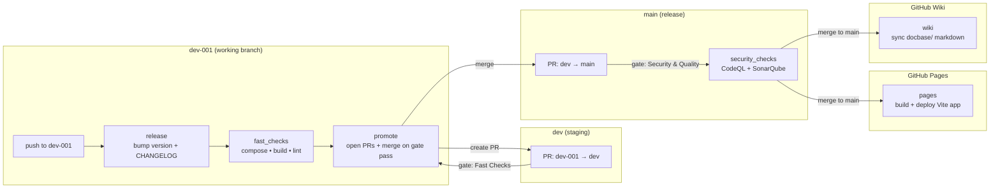
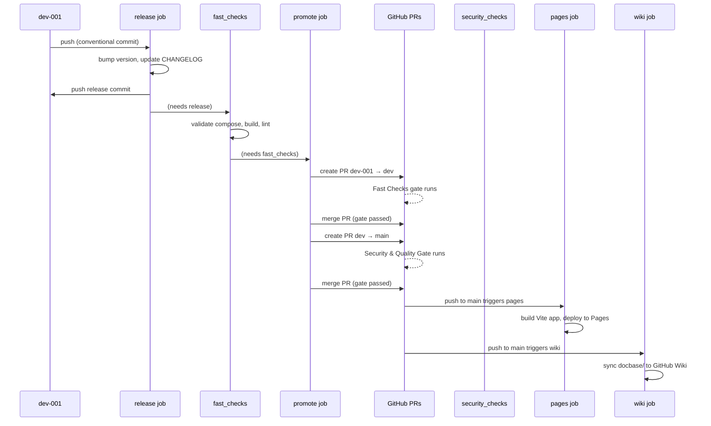
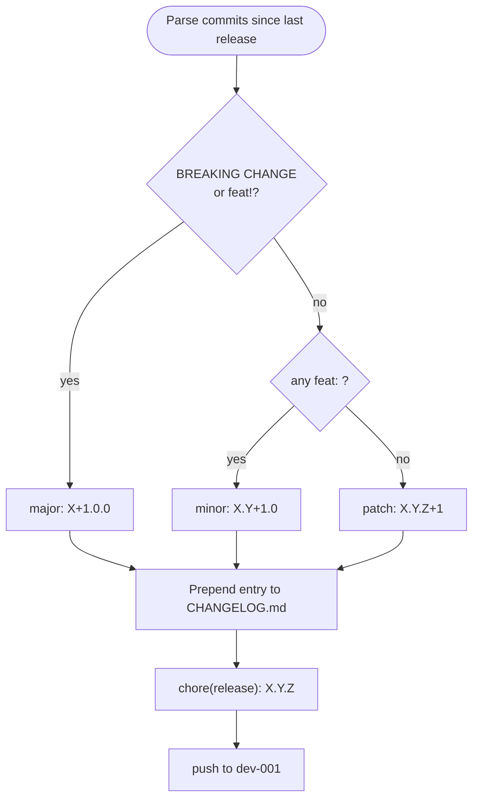
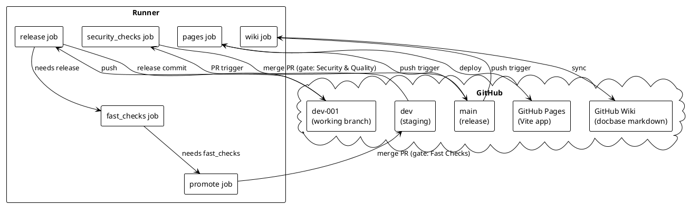

# CI/CD Pipeline

## Branch model

```
dev-001 → dev → main → GitHub Pages (app) + GitHub Wiki (docs)
```

Working branch is always `dev-001`. Promotion is automated by GitHub Actions; never push directly to `dev` or `main`.

### Pipeline overview (Mermaid)



### Promotion sequence (Mermaid)



## Stages

| Hop | Workflow job | Purpose |
| --- | --- | --- |
| `dev-001` push | `release` | Bump version (`major.minor.patch`) from conventional commits and update `CHANGELOG.md`. |
| `dev-001` → `dev` | `fast_checks` | Validate compose, build the image, lint. Gates the promotion PR. |
| `dev` → `main` | `security_checks` | CodeQL (SAST) + SonarQube Cloud (SCA + quality gate). Fails closed on findings. The SonarQube Quality Gate check exits 1 on ERROR status (fail-closed) when `SONAR_TOKEN` is configured; skipped with a notice when absent. Third-party actions are pinned to full commit SHAs. |
| `main` → Pages | `pages` | Build the React + Vite application (`codebase/site/`) and deploy to GitHub Pages. |
| `main` → Wiki | `wiki` | Sync `docbase/` markdown to the GitHub Wiki. Runs in parallel with `pages`. Non-blocking: warns and skips if the wiki is not yet initialized (needs one-time UI page creation). |

## Versioning

Versions are strict `major.minor.patch`. The `release` job parses commit subjects since the last `chore(release):` commit:

- `feat:` / `feat!:` → minor (or major if breaking)
- `fix:` → patch
- `BREAKING CHANGE:` in a body → major
- anything else → patch

### Version bump decision (Mermaid)



## Required secrets

| Secret | Used by | Description |
| --- | --- | --- |
| `GIT_PUSH_TOKEN` | release | PAT for pushing release commits. Scopes: `repo`, `workflow`. |
| `PROMOTE_TOKEN` | promote, wiki | PAT that creates/merges promotion PRs (GITHUB_TOKEN PRs don't trigger checks) and pushes docbase/ to the GitHub Wiki. Scopes: `repo`, `workflow`. |
| `SONAR_TOKEN` | security_checks | SonarQube Cloud analysis token. Optional — when absent, runs CodeQL-only SAST. |
| `NOTIFICATION_ADDRESS` | pages | Recipient email for deployment notifications. |
| `NOTIFICATION_HEADER` | pages | Email subject header for deployment notifications. |
| `NOTIFICATION_ACTIVE` | pages | `"true"` to enable notifications, `"false"` to disable. |

## Repository settings

- Enable GitHub Pages: **Settings → Pages → Source: GitHub Actions**.
- Add `dev-001` and `main` as deployment branches in **Settings → Environments → github-pages**.
- Enable the GitHub Wiki feature: **Settings → General → Features → Wikis** (the `configure-secrets.sh` script does this).
- Initialize the GitHub Wiki (one-time): open **{repo}/wiki** in the browser and create the first page. GitHub does not create the `.wiki.git` repo until this is done. The `wiki` job warns and skips (non-blocking) until then.
- Protect `dev` and `main`; require the matching status checks before merge.

### Deployment topology (PlantUML)


