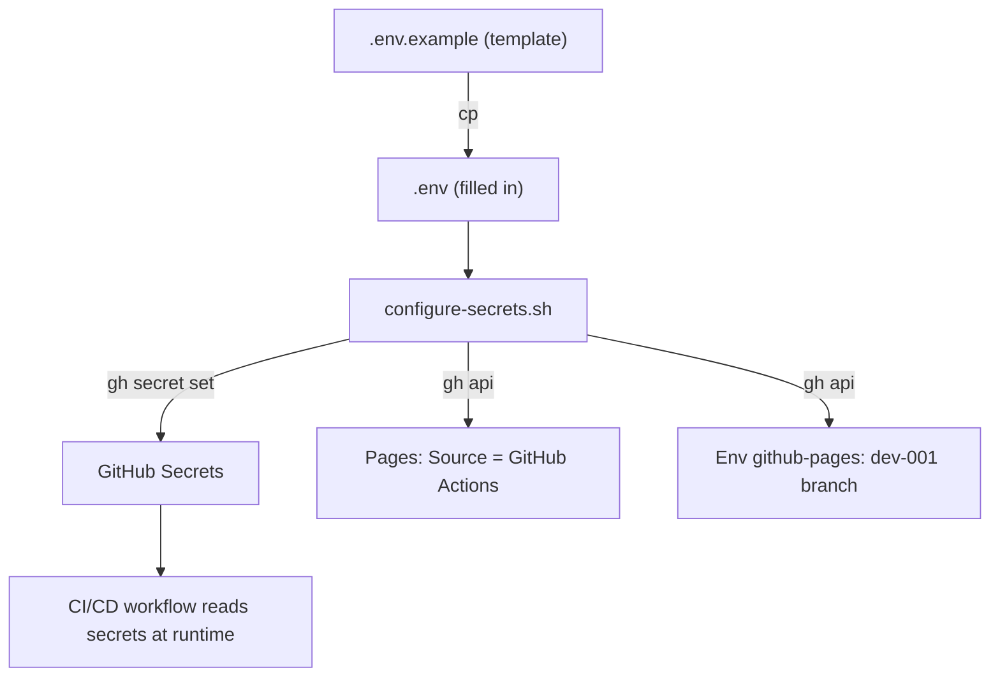

# Configurations

All configurable knobs live in `codebase/.env.example`. Copy it to `codebase/.env` and adjust. Real `.env` files are never committed.

## Application variables

| Variable | Default | Description |
| --- | --- | --- |
| `PORT` | `8080` | Host port mapped to the container. |
| `NIC` | `127.0.0.1` | Network interface the port binds to. Use `0.0.0.0` to expose publicly. |
| `IMAGE_TAG` | `latest` | Tag applied to the built image. |

## CI/CD secrets

These are stored as encrypted **repository secrets** (GitHub-hosted runners cannot read a local `.env` at runtime). Configure them from a local `.env` via the auto-config script:

```bash
cp .env.example .env          # fill in real token values
./scripts/configure-secrets.sh
```

The script pushes each value into GitHub's secret store with `gh secret set`, enables GitHub Pages (Source = GitHub Actions), and registers `dev-001` as a deployment branch for the `github-pages` environment. Real `.env` is gitignored.

### Token secrets

| Secret | Used by | Description |
| --- | --- | --- |
| `GIT_PUSH_TOKEN` | release | PAT for pushing release commits to `dev-001`. Scopes: `repo`, `workflow`. |
| `PROMOTE_TOKEN` | promote | PAT that creates/merges promotion PRs (GITHUB_TOKEN PRs do not trigger checks). Scopes: `repo`, `workflow`. |
| `SONAR_TOKEN` | security gate | SonarQube Cloud analysis token. Optional — when absent, the dev→main gate runs CodeQL-only SAST; when present, Sonar runs and fails closed on its quality gate. |

### Notification secrets

| Secret | Used by | Description |
| --- | --- | --- |
| `NOTIFICATION_ADDRESS` | pages | Recipient email for deployment notifications. |
| `NOTIFICATION_HEADER` | pages | Email subject header (e.g. `GitHub - [HKO] opencode-workflow-demo`). |
| `NOTIFICATION_ACTIVE` | pages | `"true"` to enable notifications, `"false"` to disable. Currently `false`. |

### Secrets configuration flow (Mermaid)



## Docs site

The GitHub Pages site (`docbase/site/`) deploys at the path matching the repository name. If you rename the repo, update `base` in `docbase/site/vite.config.ts`.

In addition to the Vite docs site, the raw `docbase/` and `codebase/` directories are staged into the Pages artifact so they are browseable at:

- `/{ProjectName}/docbase/` — all documentation source (markdown, TOCTREE)
- `/{ProjectName}/codebase/` — all implementation source (Dockerfile, compose, .env.example)
