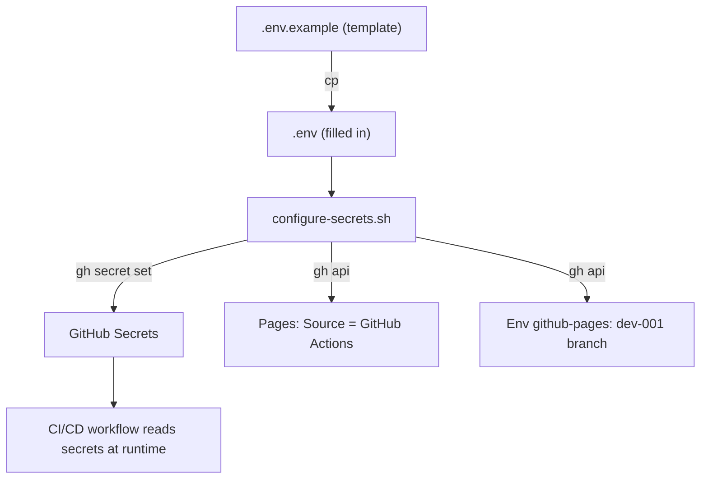

# Configurations

All configurable knobs live in `codebase/.env.example`. Copy it to `codebase/.env` and adjust. Real `.env` files are never committed.

## Application variables

| Variable | Default | Description |
| --- | --- | --- |
| `PORT` | `8080` | Host port mapped to the container. |
| `NIC` | `127.0.0.1` | Network interface the port binds to. Use `0.0.0.0` to expose publicly. |
| `IMAGE_TAG` | `latest` | Tag applied to the built image. |

## CI/CD secrets

These are stored as encrypted **repository secrets** (GitHub-hosted runners cannot read a local `.env` at runtime). Configure them from a local `.env` via the auto-config script:

```bash
cp .env.example .env          # fill in real token values
./scripts/configure-secrets.sh
```

The script pushes each value into GitHub's secret store with `gh secret set`, enables GitHub Pages (Source = GitHub Actions), and registers `dev-001` as a deployment branch for the `github-pages` environment. Real `.env` is gitignored.

### Token secrets

| Secret | Used by | Description |
| --- | --- | --- |
| `GIT_PUSH_TOKEN` | release | PAT for pushing release commits to `dev-001`. Scopes: `repo`, `workflow`. |
| `PROMOTE_TOKEN` | promote, wiki | PAT that creates/merges promotion PRs (GITHUB_TOKEN PRs do not trigger checks) and pushes `docbase/` to the GitHub Wiki. Scopes: `repo`, `workflow`. |
| `SONAR_TOKEN` | security gate | SonarQube Cloud analysis token. Optional — when absent, the dev→main gate runs CodeQL-only SAST; when present, Sonar runs and fails closed on its quality gate. |

### Notification secrets

| Secret | Used by | Description |
| --- | --- | --- |
| `NOTIFICATION_ADDRESS` | pages | Recipient email for deployment notifications. |
| `NOTIFICATION_HEADER` | pages | Email subject header (e.g. `GitHub - [HKO] opencode-workflow-demo`). |
| `NOTIFICATION_ACTIVE` | pages | `"true"` to enable notifications, `"false"` to disable. Currently `false`. |

### Secrets configuration flow (Mermaid)



## Application site

The React + Vite application (`codebase/site/`) is deployed to GitHub Pages at the path matching the repository name (`/opencode-workflow-demo/`). If you rename the repo, update `base` in `codebase/site/vite.config.ts`.

The multi-stage `codebase/Dockerfile` runs the same Vite build (`npm ci --ignore-scripts && npm run build`) in a `node` stage and serves the resulting `dist/` from an `nginx` stage. The nginx stage uses a custom `codebase/nginx.conf` (listening on port 8080) and runs as the non-root `nginx` user (`USER nginx`). The container and the Pages deploy therefore ship an identical artifact.

## Documentation (GitHub Wiki)

`docbase/` is markdown-only and is published to the repository's GitHub Wiki by the `wiki` job on push to `main`.

- The `wiki` job clones `{repo}.wiki.git`, copies `docbase/TOCTREE.md` and `docbase/docs/*.md` to the wiki root (GitHub Wiki serves pages by filename — subdirectories are not supported in URLs), generates a minimal `Home.md` and a `_Sidebar.md` (from `TOCTREE.md`), rewrites `docs/X.md` links to `X` for wiki resolution, and pushes with `--force-with-lease` (docbase is the source of truth).
- It reuses `PROMOTE_TOKEN` (its `repo` scope covers the wiki repo).
- **One-time prerequisite:** GitHub does not create the `.wiki.git` repo until the first page is saved through the web UI (there is no API to bootstrap it). Until then the `wiki` job prints a warning and exits 0 — non-blocking, does not fail the pipeline. Once initialized, subsequent runs sync normally.
- Wiki-side edits made through the browser are overwritten on the next sync; edit `docbase/` instead.
