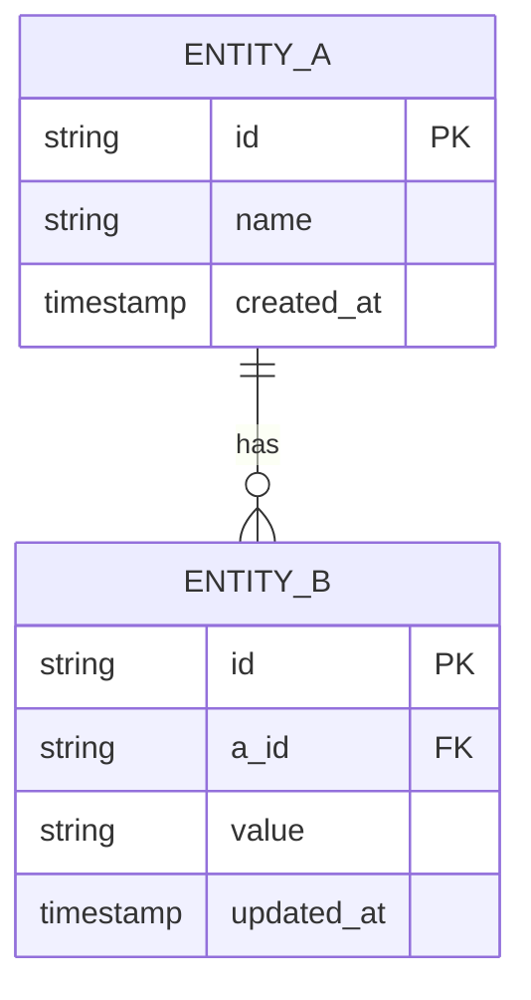
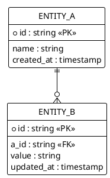

# Entity Relationship Diagram (ERD)

This template has no persistent data store yet. The diagram below shows the placeholder entities that will be replaced per project.

## Mermaid

## PlantUML

## Entities

- **ENTITY_A** — _primary entity (replace per project)_
- **ENTITY_B** — _dependent entity, many-to-one with ENTITY_A_
