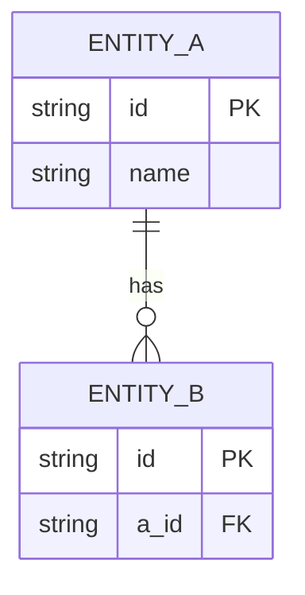

# Entity Relationship Diagram (ERD)

```mermaid
erDiagram
  ENTITY_A ||--o{ ENTITY_B : has
  ENTITY_A {
    string id PK
    string name
  }
  ENTITY_B {
    string id PK
    string a_id FK
  }
```

## Entities

- **ENTITY_A** — _description_
- **ENTITY_B** — _description_
