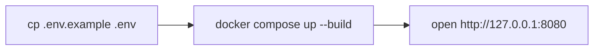
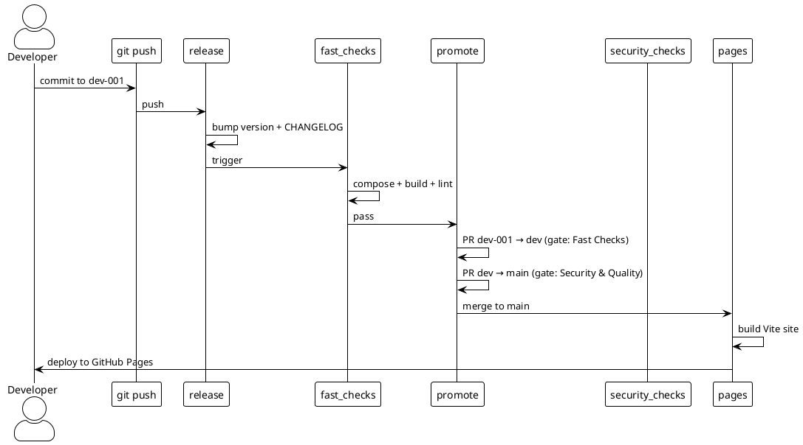

# Quick Start

## Prerequisites

- Docker
- (Optional) `jq` for pretty JSON output

## Run locally



1. Copy the environment file and adjust values:

   ```bash
   cp codebase/.env.example codebase/.env
   ```

2. Build and start the service:

   ```bash
   docker compose --env-file codebase/.env --project-directory codebase up --build
   ```

3. Open <http://127.0.0.1:8080> in a browser.

## Stop

```bash
docker compose --env-file codebase/.env --project-directory codebase down
```

## CI/CD setup (PlantUML)


